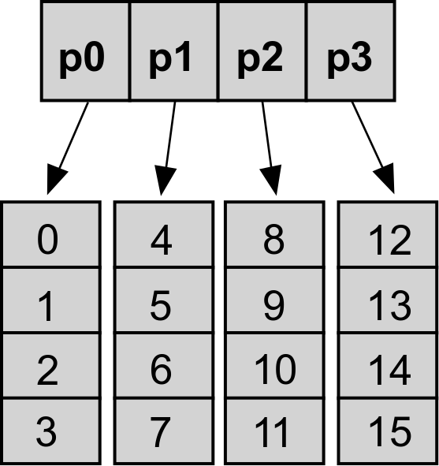

# CS136-Final-Project
## Hashed Array Tree: A list data type 

A dynamic array data structure that has an array of particular values with separate allotments of data, called leaves, that are specific to each element in the array. 
Each leaf is an array, which is pointed to by the parent array, and is the same size as the parent array.

Here's an example of a Hashed Array Tree with 16 elements and 4 leaves in the parent array:

Our implementation of a Hashed Array Tree will help with an application that uses real-life movie data to store information including movie titles, genre, release year, and director. 

A challenge we have encountered is the time-space tradeoff of using a dynamic array which has the capacity to waste an enormous amount of space. For example, if our parent array is n elements big, then each leaf is also n elements big, and if we only use 3 elements of the child array, then we have a waste of n-3 elements. The bigger the dataset, the more wastage we have.
	- So we decided that instead of inserting every movie in a dataset, we would instead sort by a user-specified query and have a set number of movies inserted into the Hashed Array Tree. 

## Data

Our data comes from the 

